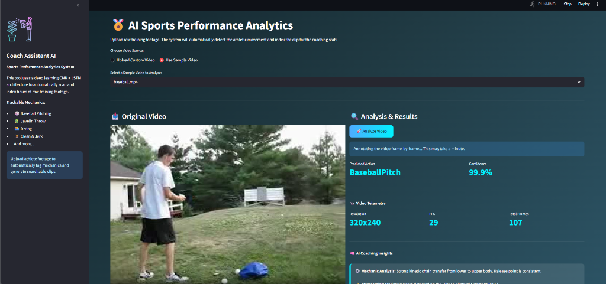
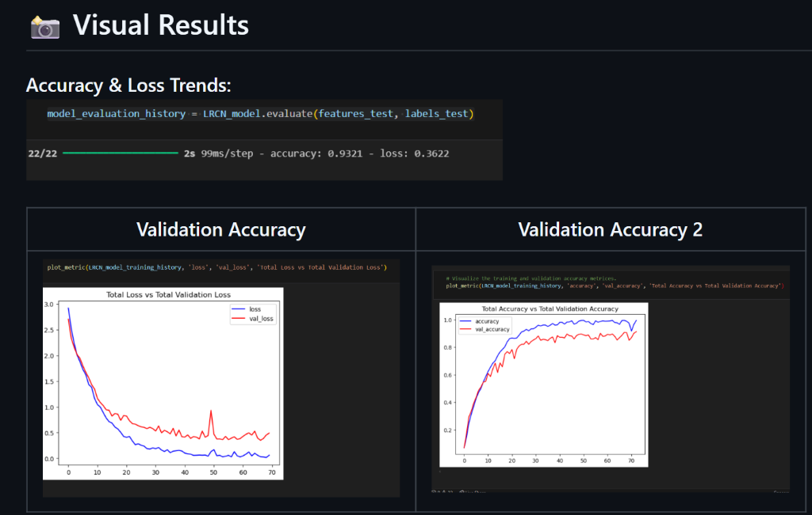

# AI-Powered Video Classification System

This project introduces an AI-powered Video Classification System that:
- Uses **CNN + LSTM** to detect human actions from video feeds.
- Combines spatial (frame features) and temporal (movement patterns) learning for accurate action recognition.
- Enables real-time applications such as:
  - ✅ **Smart Surveillance** → Detect abnormal or suspicious activities automatically.
  - ✅ **Sports Analytics** → Action tracking for performance optimization.
  - ✅ **Fitness Monitoring** → Exercise classification for personal training.

## 📊 Dataset
**Dataset Used:** UCF50 Dataset
- 50 real-world human activity classes (first 20 used for training).
- Videos vary in length, resolution, and camera angles.
- Includes actions like running, walking, fighting, push-ups, biking, etc.

## 🎯 Objective
Develop a system that watches video streams and predicts the activity (e.g., running, fighting, jumping) for real-time surveillance and anomaly detection.

## ✅ Approach
- **CNN:** Extracts spatial features (objects, body pose) from each frame.
- **LSTM:** Learns temporal dynamics of movement across frames.
- **Softmax Layer:** Predicts one of the action classes.

## 🛠️ Workflow
1. **Frame Extraction** → Extract 20 evenly spaced frames per video using OpenCV, resize & normalize.
2. **Feature Extraction (CNN)** → Apply CNN to get spatial features.
3. **Temporal Modeling (LSTM)** → Pass sequence of features to LSTM.
4. **Classification** → Predict activity class with Softmax.

## 📈 Performance
- **Final Accuracy:** 93.21%
- **Loss:** 0.3622
- **Training Speed:** 99 ms/step (GPU optimized)
- **Classes Used:** 20 out of 50 UCF50 actions

## 📸 Visual Results

### AI Dashboard UI


### Accuracy & Loss Trends


## 🧪 Applications
- 🔍 **Smart Surveillance** → Automated detection of abnormal or suspicious activities.
- ⚽ **Sports Analytics** → Tracking and performance insights for players.
- 🏋️ **Fitness Monitoring** → Detect exercises for real-time feedback.
- 🎥 **Video Intelligence on IoT Devices** → Smart city security.

## 🔮 Future Scope
- ⏱️ Real-time inference on live CCTV streams.
- 📦 Extend to all 50 UCF50 classes.
- 🚀 Deploy in airports, stadiums, and smart city infrastructure.

## ✅ Tech Stack
- **Language:** Python
- **Libraries:** TensorFlow, Keras, OpenCV, NumPy, Streamlit
- **Model:** CNN + LSTM
- **Dataset:** UCF50

## ▶️ How to Run

```bash
# Clone repository
git clone https://github.com/your-username/video-surveillance.git
cd video-surveillance

# Install dependencies
pip install -r requirements.txt

# Run the Streamlit web app
streamlit run app.py
```
